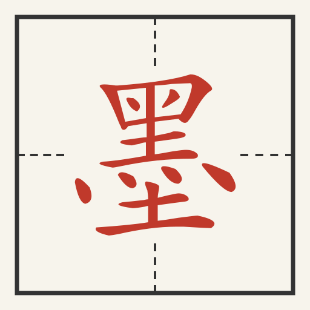

<p align="center">
  
</p>

# 朱墨（Zhumo）

书法讲评视频分析平台。上传一段老师讲评习字的视频，agent 编排计算机视觉管线：
探针 → 抽帧 → 转正 → 对齐 → 背景合成 → 田字格检测 → 旁注提取 → 焦点剪辑 →
语音转录，摘要由 agent 亲自撰写，最终产出可公开分享的分析结果页。

> 名字取自讲评的本质动作：学生落**墨**，先生施**朱**。
> 产品界面同样是纸（米白）、墨（深字）、朱（批注红）三色。

## 仓库结构

```
├── PRODUCT_DESIGN.md        产品设计文档（权威规范）
├── samples/                 样例视频（mp4 本地自备，不入库）
├── docs/                    阶段性工作报告与交付物
├── shufa-server/            产品主仓库（pnpm monorepo，Node ≥24）
│   ├── contracts/           Zod 契约（前后端共享类型）
│   ├── daemon/              服务端：oRPC-over-WS + SQLite + agent 内核 + 分析能力面
│   ├── webui/               前端（Svelte 5 + shadcn-svelte；dist 预编译随仓库分发）
│   ├── scripts/             一键 E2E（w7b-e2e.mjs）
│   ├── skills/              agent 的管线手册（SKILL.md）
│   └── changes/             变更记录（按波次）
└── shufa-tool/              Python 分析管线（uv；当前参考实现）
    └── web/                 打磨版分析页源码（结果页的移植母本）
```

## 快速开始

```bash
cd shufa-server
pnpm install                # dsh 内核（@zhumo 依赖面）随 workspace 就位，无需全局安装
cp .env.example .env        # 按需填写；管理员留空则首启进入安装向导
pnpm --filter @zhumo/daemon start
```

依赖：Node ≥24、pnpm、Python 环境经 [uv](https://docs.astral.sh/uv/)（向导会引导）、ffmpeg。
详见 [shufa-server/README.md](shufa-server/README.md)。

## 测试

```bash
cd shufa-server && pnpm -r test          # 单测
node scripts/w7b-e2e.mjs --dry-run       # E2E 链路回归（无真实模型）
```
